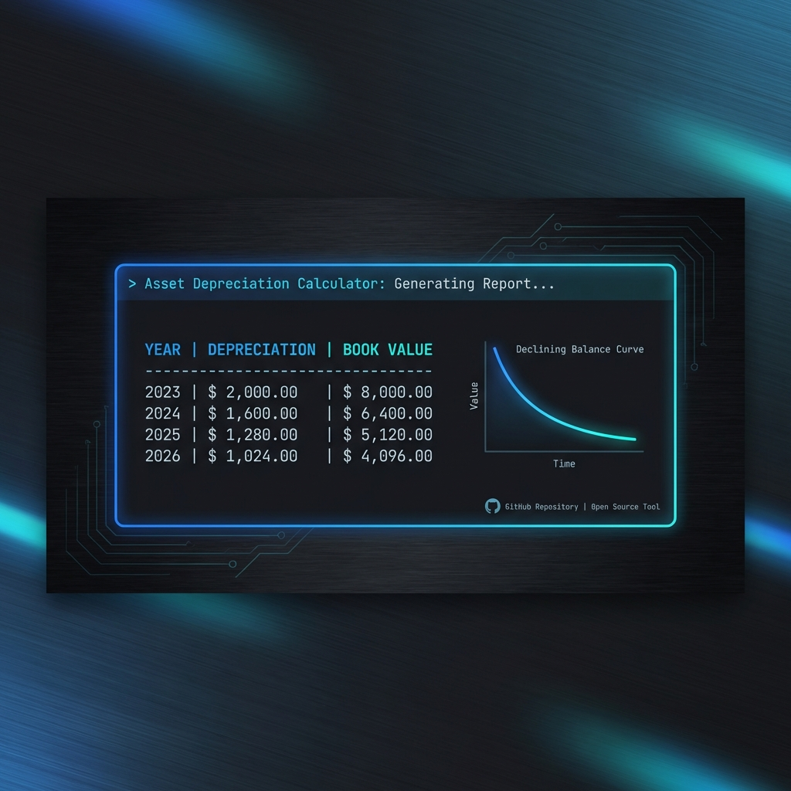

# Asset Depreciation Calculator



A shell script to calculate yearly and aggregated monthly depreciation for assets defined in a YAML file.

## Features
- **Methods**: Supports **Straight-Line** (default) and **Declining Balance** (Double Declining) methods.
- **YAML Data**: Loads asset details (value, lifespan, mode, salvage value) from a simple YAML config.
- **Aggregate Reporting**: Optional monthly schedule that groups identical depreciation periods and calculates annualized impact.
- **Date Aware**: Starting month can be customized, and report periods are labeled with human-readable dates (e.g., `Jan 2026 - Dec 2026`).
- **Precision**: Uses `bc` for high-precision floating-point arithmetic.
- **Visuals**: Clean, colored, and formatted terminal output.

## Prerequisites
- `yq`: For parsing YAML files.
- `bc`: For floating-point calculations.

## Usage
1.  **Define assets** in `assets.yaml`:
    ```yaml
    assets:
      - name: "Office Server"
        value: 8000
        lifespan: 4
        mode: "Declining Balance"
        salvage_value: 800
      - name: "Office Furniture"
        value: 1200
        lifespan: 10
        # mode defaults to Straight-Line
        salvage_value: 100
    ```

2.  **Run the script**:
    ```bash
    # Basic yearly report
    ./depreciate.sh

    # Yearly report + Aggregated Monthly Schedule
    ./depreciate.sh -m

    # Aggregated Monthly Schedule starting from a specific date
    ./depreciate.sh -m 2026-03

    # Use a custom YAML file
    ./depreciate.sh my_assets.yaml -m
    ```

## CLI Options & Parameters
- `-m`: Enables the "Overall Monthly Depreciation Schedule" at the end of the report.
- `YYYY-MM`: (Optional) Sets the starting month for the date labels. Defaults to the current month.
- `file.yaml`: (Optional) Path to the asset configuration file. Defaults to `assets.yaml`.

## Installation
Ensure the script is executable:
```bash
chmod +x depreciate.sh
```
